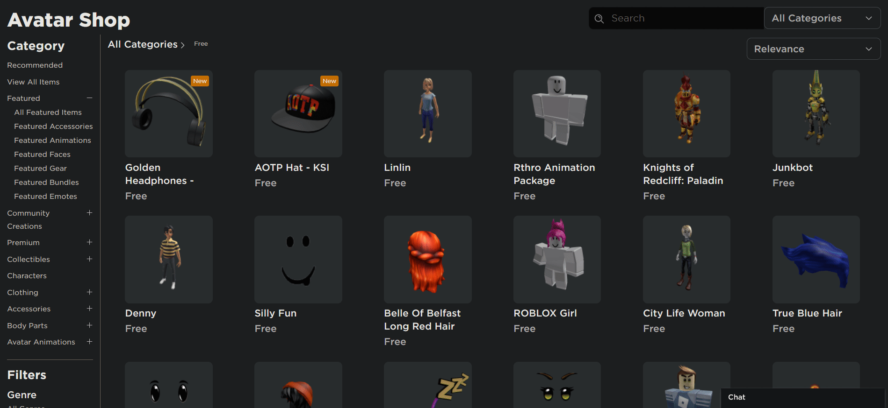

    
    <h1>Roblox Semi Auto Free Buyer (RSAFB)</h1>
    
<i>Yes. im not great with names!</i>

    
A user script that will lessen the work in grabbing free items from Roblox's Catalog

## How does it work?

This user script will automatically click the "Get" button on catalog item pages that are free before automatically confirming your purchase when the confirmation popup appears. Simply click on a free item in the catalog page and the script will grab it for you automatically.

## How do I get it?

1. First, install a user script injector extension for your browser

Here are a list of various user script injectors. If there is something that isn't listed, or something that you have tested, please feel free to contribute!

Name|Browser(s)|Works?
-|-|-
Violentmonkey|Firefox|Yes
Violentmonkey|Multiple|WIP
Tampermonkey|Multiple|Untested
Greasemonkey|Firefox|Untested

2. Depending on how your extension works, it may automatically grab the script when presented on a webpage or you may have to manually add it in (As a note, I am writing these instructions off of the experience from using Violentmonkey on firefox to which if you are using another user script injector plugin and or using a different browser, results may be different!)
    - **If it can automatically grab the script**
        1. click [here](https://github.com/PaxiTheAlchemist/robloxSemiAutoFreeBuyer/blob/main/robloxSemiAutoFreeBuyer.user.js) to view the raw code to which your extension should pick up if it has the ability to do so.
            - If for whatever reason the link above fails, click "robloxSemiAutoFreeBuyer.user.js" within the file list above to view the code. Your extension may possibly notify you that it can grab the script there, and if so, skip step 2
        2. If your extension does not grab the script as explained in the previous step, click "RAW" to view the raw code and your extension should be able to pick it up.
   - **If it cant automatically grab the script**
        1. Open your extension to which there should be some form of method to add a script
        2. Click [here](https://github.com/PaxiTheAlchemist/robloxSemiAutoFreeBuyer/blob/main/robloxSemiAutoFreeBuyer.user.js) to view view the raw code (if your extension notifies you that it can grab it automatically from here, your extension is probably automatic)
        3. Copy the code and paste it into the text area to which your extension should have provided you
        4. Save the pasted content within your extension's page/editor
3. Profit!

## Disclaimer

***This script does not buy items that cost Robux or buy priced items for free nor was it designed to do so. If the script does not follow what it was designed to do, the roblox site may have been updated and thus has broken the script***

This project and also I, the creator of the project, have no affiliation with Roblox Corporation